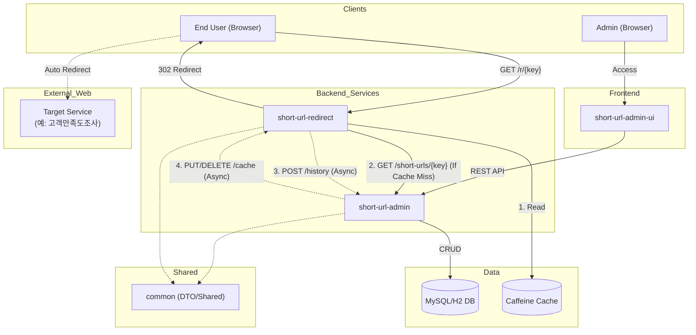
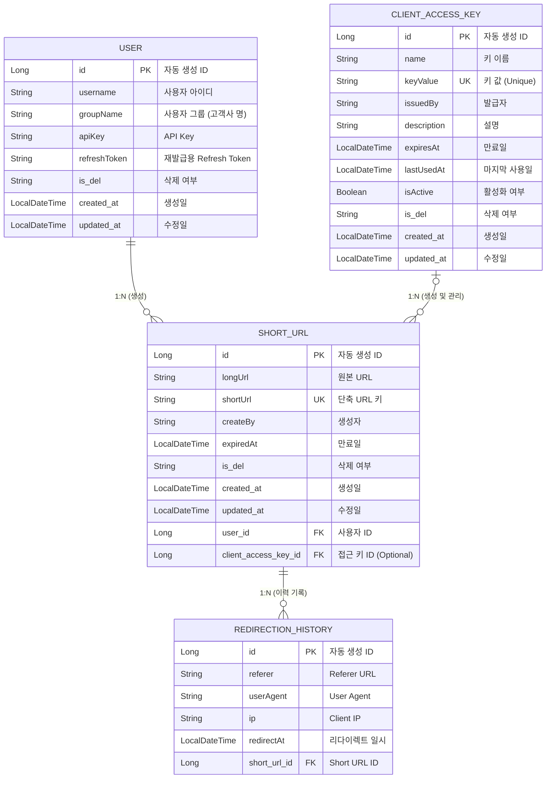

# 모듈 기능 개요 및 관계도

본 문서는 `shorturl-api` 프로젝트를 구성하는 각 모듈의 역할과 책임을 명확히 정의하고, 모듈 간의 유기적인 상호작용을 시각화하여 전체 시스템 아키텍처를 빠르게 파악하는 것을 목적으로 합니다.
시스템은 크게 관리 및 운영을 담당하는 **Admin**, 실제 트래픽을 처리하는 **Redirect**, 그리고 공통 규격을 정의하는 **Common** 모듈로 구성되어 있으며, 이를 활용하는 예시 **UI**가 포함되어 있습니다.

## 모듈별 주요 기능

### common
- **short-url-admin과 short-url-redirect에서 사용하는 공통 요청/응답 객체를 관리하는 모듈입니다.**
- **표준 응답 규격**: `ResultEntity`와 `ApiResult`(성공/실패 코드)를 통해 시스템 전체의 일관된 응답 포맷을 제공합니다.
- **DTO 및 유효성 검증**: 모듈 간 데이터 교환에 사용되는 객체와 입력값 검증(`jakarta.validation`) 어노테이션을 공유합니다.

### short-url-admin
- **인증 (Auth)**
  - `POST /api/auth/token/issue`: 토큰 발급
  - `POST /api/auth/token/re-issue`: 토큰 재발급
- **단축 URL (ShortUrl)**
  - `POST /api/short-url`: 단축 URL 생성
  - `GET /api/short-url/{id}`: ID 기반 단건 조회
  - `GET /api/short-url/key/{shortUrl}`: 키 기반 단건 조회
  - `POST /api/short-url/delete/{id}`: 단축 URL 삭제
  - `GET /api/short-url`: 목록 조회 (페이징)
  - `PUT /api/short-url/{id}/expiration`: 만료일 수정
- **클라이언트 키 (ClientAccessKey)**
  - `GET /api/client-keys`: 목록 조회
  - `POST /api/client-keys`: 키 발급
  - `PUT /api/client-keys/{id}`: 키 정보 수정
  - `DELETE /api/client-keys/{id}`: 키 삭제
- **사용자 (User)**
  - `GET /api/users`: 사용자 목록
  - `POST /api/users`: 사용자 등록
  - `GET /api/users/{username}`: 사용자 상세
  - `DELETE /api/users/{username}`: 사용자 삭제
- **통계 (History)**
  - `GET /r/history/{shortUrlId}/count`: 리다이렉션 카운트
  - `POST /r/history/{shortUrlId}/stats`: 통계 데이터 조회
- **내부 API (Internal)**
  - `GET /api/internal/short-urls/{shortUrlKey}`: 리다이렉트 모듈용 단건 조회
  - `GET /api/internal/short-urls/all`: 캐시 웜업용 전체 조회
  - `POST /api/internal/redirection-histories`: 리다이렉트 로그 저장

### short-url-redirect
- **리디렉션 (Redirect)**
  - `GET /r/{shortUrl}`: 원본 URL로 리다이렉트 (비동기 로그 전송)
- **캐시 관리 (Cache Management)**
  - `PUT /api/internal/cache/short-urls`: 단축 URL 캐시 갱신
  - `DELETE /api/internal/cache/short-urls/{shortUrlKey}`: 캐시 삭제

### short-url-admin-ui
- **API 활용을 위한 레퍼런스(Sample) UI 모듈입니다.**
- **기능 예시**:
  - **대시보드**: 통계 API를 활용한 데이터 시각화 예시
  - **단축 URL 관리**: 생성/조회/삭제 및 만료일 설정 등 핵심 기능의 UX 구현
  - **인증/키 관리**: JWT 로그인 및 클라이언트 접근 키 발급/관리 흐름 예시
- React, Vite 기반으로 작성되어 있어, 실제 서비스 구축 시 프론트엔드 연동 가이드로 활용할 수 있습니다.

## 모듈 관계도 

## ERD

## 향후 적용 및 배포 계획 (Deployment Plan)

각 모듈의 특성에 맞춘 효율적인 배포 전략을 수립하여 운영 안정성과 확장성을 확보할 계획입니다.

### 1. short-url-admin
**운영 모드 분석**
- **옵션 A: 단독 실행 모드 (Standalone Service)**

- **옵션 B: 라이브러리 배포 모드 (Embedded JAR)**
  - **설명**: `jar` 라이브러리 형태로 빌드하여 **운영포털이나 봇프레임워크**에 포함시켜 배포하는 방식

### 2. short-url-redirect
**운영 모드 분석**
- **단독 실행 모드 (Standalone Service)**
  - **설명**: 리다이렉션 트래픽 처리에만 집중하는 경량화된 독립 모듈로 운영합니다.
  - **이유**:
    - **독립적 스케일 아웃**: 리다이렉션 요청은 읽기(Read) 트래픽이 압도적으로 많기 때문에, Admin 모듈과 분리하여 독립적으로 인스턴스를 늘릴 수 있어야 합니다.
    - **장애 격리**: 대량의 트래픽 유입 시 다른 서비스(Admin 등)에 영향을 주지 않아야 합니다.