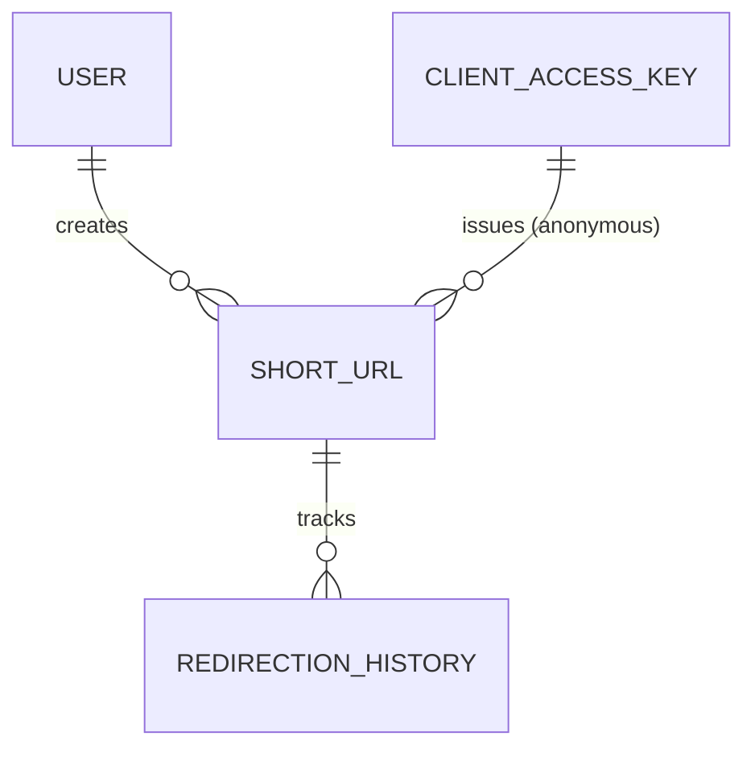
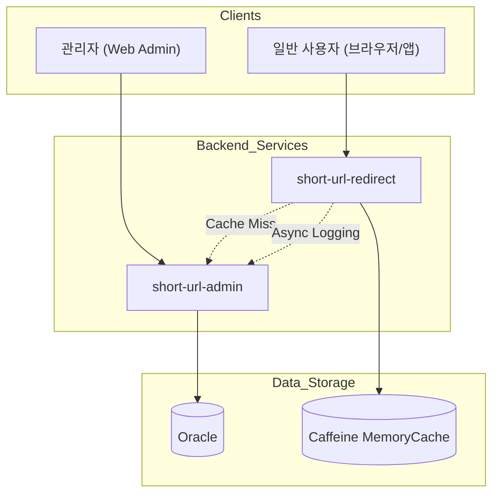

# Short URL - 도메인 설계서 (Domain Design)

## 1. 개요
본 문서는 `shorturl-api` 시스템의 백엔드 서비스를 구축하기 위한 도메인 모델 및 아키텍처 설계를 다룹니다. 이 시스템은 긴 URL을 짧은 키로 변환하여 관리하고, 접속 시 원래의 URL로 리다이렉션하며 접속 통계를 수집하는 것을 핵심 기능으로 합니다.

---

## 2. 핵심 도메인 모델 (Core Domain Entities)

### 2.1 사용자 및 인증 (User & Auth)
시스템을 이용하는 관리자나 연동 고객사를 정의합니다.

*   **User (사용자/고객사)**
    *   `id`: PK (자동 생성 ID)
    *   `username`: 사용자 아이디 (고유 식별값)
    *   `group_name`: 소속 그룹 또는 고객사 명칭
    *   `api_key`: API 호출 시 사용하는 인증 키
    *   `refresh_token`: API Key 재발급을 위한 갱신 토큰
    *   `is_del`: 삭제 여부 (Y/N)
    *   `created_at`: 생성 일시
    *   `updated_at`: 최종 수정 일시

*   **ClientAccessKey (클라이언트 접근 키)**
    *   비회원(Anonymous) 기반의 단축 URL 생성을 위해 발급되는 고유 키입니다.
    *   `id`: PK (자동 생성 ID)
    *   `name`: 키 별칭 (예: NH-Bank-App)
    *   `key_value`: 실제 사용될 키 문자열 (Unique)
    *   `issued_by`: 발급 담당자
    *   `description`: 상세 설명 및 비고
    *   `expires_at`: 키 만료 일시
    *   `last_used_at`: 최근 사용 일시
    *   `is_active`: 활성 상태 여부 (Y/N)
    *   `is_del`: 삭제 여부 (Y/N)

### 2.2 단축 URL 관리 (Short URL Management)
원본 URL을 짧은 키로 매핑하고 관리합니다.

*   **ShortUrl (단축 URL)**
    *   `id`: PK (고유 번호)
    *   `long_url`: 원본 URL 주소
    *   `short_url`: 생성된 단축 키 (Base62 인코딩 값)
    *   `user_id`: FK (User - 생성 관리자)
    *   `client_access_key_id`: FK (ClientAccessKey - 비회원 발급용 키)
    *   `expired_at`: 단축 URL 만료 일시
    *   `bot_type`: 봇 구분 (CALLBOT, CHATBOT)
    *   `bot_service_key`: 봇 서비스 식별 키 (전화번호/세션키)
    *   `survey_id`: 연관된 설문 ID
    *   `survey_ver`: 연관된 설문 버전
    *   `is_del`: 삭제 여부 (Y/N)

### 2.3 통계 및 이력 (Statistics & History)
단축 URL을 통한 접속 데이터를 기록합니다.

*   **RedirectionHistory (리다이렉션 이력)**
    *   `id`: PK (자동 생성 ID)
    *   `short_url_id`: FK (ShortUrl)
    *   `referer`: 유입 경로 (이전 페이지 주소)
    *   `user_agent`: 접속 단말의 브라우저 및 기기 정보
    *   `ip`: 접속 IP 주소
    *   `device_type`: 디바이스 구분 (Mobile, Desktop 등)
    *   `os`: 운영체제 명칭
    *   `browser`: 브라우저 명칭
    *   `country`: 접속 국가 코드
    *   `city`: 접속 도시 명칭
    *   `redirect_at`: 리다이렉션 실행 일시
    *   `bot_type`, `bot_service_key`: 접속 시점의 봇 정보 스냅샷
    *   `survey_id`, `survey_ver`: 접속 시점의 설문 정보 스냅샷

---

## 3. 엔티티 관계도 (ERD Conceptual)

---

## 4. 주요 서비스 기능 (Service Layer)

1.  **ShortUrlService (단축 URL 서비스)**
    *   난수 및 Base62 인코딩을 활용한 유니크 단축 키 생성.
    *   사용자 권한별 URL 생성 및 유효기간 관리.
    *   캐시를 활용한 원본 URL 조회 최적화.

2.  **RedirectionService (리다이렉션 엔진)**
    *   단축 키를 기반으로 원본 URL을 찾아 HTTP 302 Redirect 수행.
    *   접속자의 User-Agent 정보를 분석하여 디바이스/OS/브라우저 정보 추출.
    *   비동기(Event 방식) 처리를 통한 대량 리다이렉션 로그 저장.

3.  **AnalyticsService (통계 분석)**
    *   리다이렉션 이력을 기반으로 기간별/기기별/유입경로별 통계 산출.
    *   특정 단축 URL에 대한 실시간 접속 카운트 제공.

---

## 5. 기술적 고려 사항

*   **고성능 리다이렉션**:
    *   `short-url-redirect` 모듈은 조회 전용 캐시(Local Cache)를 적용하여 DB 부하를 최소화합니다.
    *   캐시 미스 시에만 `short-url-admin` 모듈을 통해 DB에서 정보를 조회하고 캐시를 갱신합니다.
*   **비동기 로깅**:
    *   리다이렉션 발생 시 사용자에게 빠른 응답을 주기 위해 로그 저장은 비동기로 처리하며, 로그 유실 방지를 위해 메시지 큐 또는 별도의 버퍼링 전략을 고려합니다.
*   **장애 격리**:
    *   관리 페이지(Admin)와 리액션 처리 모듈(Redirect)을 분리하여 대량 트래픽 발생 시에도 관리 기능의 가용성을 확보합니다.

---

## 6. 모듈 아키텍처 및 데이터 흐름

### 6.1 아키텍처 구성도

